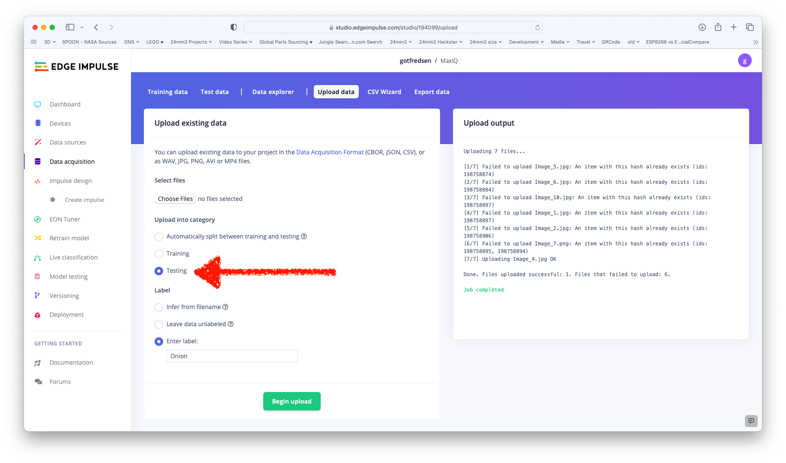
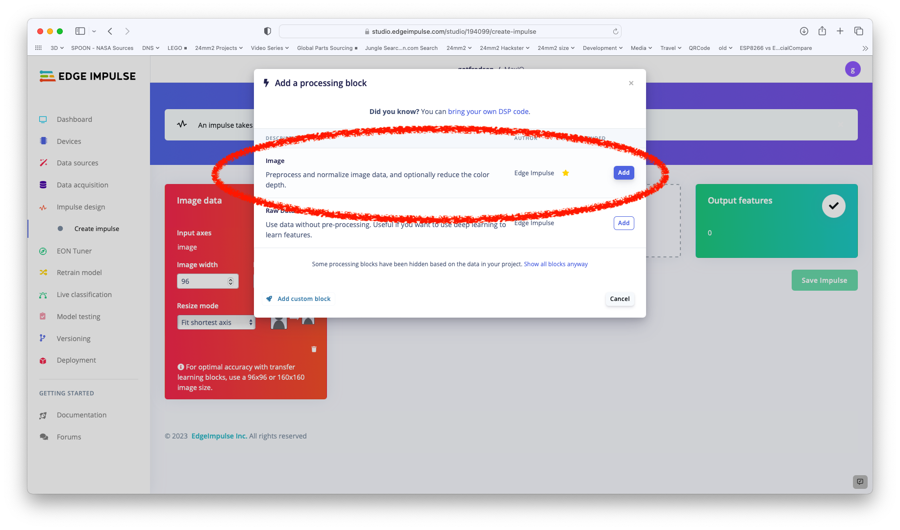

# Artificial Intelligence

While this repository is called AI, there are a distinct between the terms used in the AI world. So while this repository perhaps should have a more accurate name, I have chosen to call it AI, and let the reader check out this article from IBM: [AI vs. Machine Learning vs. Deep Learning vs. Neural Networks: What’s the Difference?](https://www.ibm.com/cloud/blog/ai-vs-machine-learning-vs-deep-learning-vs-neural-networks)

## Steps
This AI experiment covers a number of steps:
1. Get your hardware in order
2. Find training material to train your AI model
3. Build your AI engine
4. Modify your code to use the AI engine - don't worry, you get the code here, and you have to change 1 line of code!
5. Try it out

## Hardware
In this repository we are using the extended core [CVW](https://github.com/domino4com/CWV) with a camera, the OLED display [ODA](https://github.com/domino4com/ODA) and the power- and programmer unit [PPU](https://github.com/domino4com/PPU)

First check out this repository [CWV Camera](https://github.com/domino4com/CWV-Camera), which also has links and camera recommendations. Make sure you complete complete the camera example, so you know all your hardware is in order. Also if you haven't ever programmed the CWV, then visit this repositoiry first [CVW](https://github.com/domino4com/CWV).

You also need a OLED Library. For this exercise, 
* Install `U8g2 by oliver <olikraus@gmail.com>`. 
* Then open `Full Buffer` -> `Hello world`.
* Add these lines to where it says "UNCOMMENT"
```C
#define SDA 26
#define SCL 27
U8G2_SSD1306_128X64_NONAME_F_SW_I2C u8g2(U8G2_R0, /* clock=*/ SCL, /* data=*/ SDA, /* reset=*/ U8X8_PIN_NONE);   // All Boards without Reset of the Display
```
* Run the example and notice a `Hello World!` in the display.

## Training material
You can either start shooting images your self using your phone camera or you can download datasets with images for traing and testing. Making your own photos is much better, since you know the enviroment your model is going to operate in. Say you want to distinquis between onions, chili peppers and bananas, and the onions are always whole red onions. Then you don't need half onions, onion slices, deep fried onion rings, garlic, chives and other onion types. If the banana is always a single whole banana (called a finger), then you don't need a group of banana (called hand and stalk or bunch), nor banana peel, banana split, you get the idea. The better and more accurate the trainiung material the better accuracy.

For this example we are going to download a dataset (2Gb) from [Kaggle](https://www.kaggle.com). Go here first and create a free account. Then download [this fruit/veg dataset](https://www.kaggle.com/datasets/kritikseth/fruit-and-vegetable-image-recognition)

This dataset contains around 100 training images of all kinds of fruit and vegatable and 10 test images. You need to go to the kitchen and find say 3 pieces of different fruit and vegtable. In my pantry I found a banana, a red onion and a red chili pepper. So the rest of the example is based on that, but you can choose anything.

## Build your AI engine.
This is where the magic happens. We are going to use [Edge Impulse](https://edgeimpulse.com), so go here and create an account.

This is the steps:








* Create a project.
* Specify `Images`
* ...and `Classify a single object (Image classification)`
* Then go to the uploader
* In the uploader choose go to the `train` folder and then to your object, say Banana. Select them all.
* Then select the `Training` option
* And enter a label. Make it short for the sake of the chosen font for the OLED. Like 6 characters long
* Repeat for all objects
* And the do the same for test files. Chose the `test` forlder and upload the imsages for each of the objects. Remember to select `Testing` and same labels.
* As you upload, some files are successful and some fails. Ignore that for this experiment.
* Now you are ready to create an impulse.
* Click on add a processing block and again a learning block
* Chose the `Image` for the processing block
* And chose `Transfer Learning (Images)` for the learning block
* Save the impulse
* Then go to images (below Create Impulse in the left menu)
* Click on `Generate features`
* Thus 


## Deploy

## Run it

> Ignore the flickering Neopixel, ... shared pin
